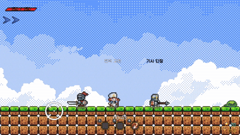

# Dungeon Breakers



libGDX(Java)로 만든 2D 로그라이크 던전 액션 게임입니다.
분기형 맵에서 경로를 선택하며 전투·상점·보상·휴식 노드를 거쳐 보스를 공략합니다.

- **개발 기간:** 2025.09.30 ~ 2025.11.30
- **개발 인원:** 3인 팀
- **담당 역할:** 기획 및 개발 총괄 — 게임 코드 전체 구현 (전투·맵·아이템·UI·세이브 시스템)
  - 팀원: 아이템 능력치 데이터 작성, Tiled 맵 레벨 디자인
- 이 저장소는 원본 개발 저장소에서 라이선스상 재배포할 수 없는 서드파티 에셋을 제외하고 옮긴 **공개용 미러**입니다. 원본의 커밋 기록은 포함되어 있지 않습니다.

> ▶️ **플레이는 [Releases](../../releases)에서 jar를 받아 실행**하세요. (에셋 출처: [CREDITS](CREDITS.md))

## 실행

Windows x64 · Java 17 이상 필요

```bash
java -jar DungeonBreakers-1.0.0-win64.jar
```

## 주요 기능

- **분기형 던전 맵** — 전투 / 상점 / 상자 / 휴식 / 보스 노드, 노드 잠금·해금 상태 관리 (`MapScreen`, `DungeonMapManager`, `MapNode`)
- **실시간 전투** — Box2D 물리 기반 충돌 처리, 투사체, 데미지 텍스트 (`GameScreen`, `GameContactListener`, `Projectile`)
- **캐릭터 & 전직** — 직업별 플레이어 클래스, NPC를 통한 전직·캐릭터 해금 (`AbstractPlayer`, `Archer`, `Knight`, `JobChangeUI`, `UnlockUI`)
- **적 & 보스 AI** — 공통 추상 클래스 기반 몬스터·보스 패턴 (`AbstractEnemy`, `ArmoredSkeleton`, `SkeletonArcher`, `Boss`)
- **아이템 & 인벤토리** — 장비 능력치 적용, 드랍 아이템, 상점, 퀵슬롯 (`ItemManager`, `InventoryUI`, `ShopUI`)
- **Tiled 맵** — `.tmx` 맵 로딩 및 스폰 트리거 (`GameMapManager`, `SpawnTrigger`)
- **세이브 슬롯** — `Preferences` 기반 저장/불러오기 (`SaveManager`)

## 설계 포인트

Unity 같은 상용 엔진의 씬·컴포넌트 시스템 없이, libGDX 프레임워크 위에서 게임 구조를 직접 설계했습니다.

- **템플릿 메서드 기반 캐릭터 계층** — `AbstractPlayer`가 이동·점프·대시·피격·쿨다운·애니메이션 상태를 공통으로 처리하고, 직업 클래스는 `performSkillAction()`만 구현합니다. 새 직업은 스킬만 작성하면 추가됩니다. 적도 `AbstractEnemy`로 같은 구조를 따릅니다.
- **절차적 분기 맵 생성** — `DungeonMapManager`가 스테이지마다 노드를 무작위로 배치하고, 가장 가까운 노드끼리 연결한 뒤 일정 확률로 교차 경로를 추가합니다. 부모가 없는 노드는 역으로 연결해 막다른 경로가 생기지 않게 하고, 한 노드를 고르면 같은 열의 다른 노드는 닫혀 경로 선택에 의미가 생깁니다.
- **Box2D 충돌 필터링** — 카테고리·마스크 비트로 충돌 대상을 분리하고, Fixture의 UserData로 충돌 주체를 구분합니다. 발 센서로 착지를 판정하고, 센서형 `SpawnTrigger`가 플레이어 진입 시 몬스터를 스폰합니다.
- **데이터 주도 아이템** — 189개 아이템을 부위별 JSON으로 분리해, 코드 수정 없이 능력치를 조정할 수 있게 했습니다. 이 구조 덕분에 팀원이 JSON만으로 밸런스 작업을 할 수 있었습니다.
- **코드와 레벨 디자인 분리** — Tiled 맵의 오브젝트 이름(`player_spawn`, `dungeon_entrance`, `*_spawn` 등)을 읽어 스폰 위치를 정합니다. 팀원이 Tiled에서 맵만 만들면 코드 변경 없이 게임에 반영됩니다.
- **엔티티 수명 관리** — `EntityManager`가 적·투사체·코인·아이템을 종류별로 관리하며, 사망 애니메이션이 끝난 뒤 물리 바디를 파괴하고 목록에서 제거합니다.

## 기술 스택

- Java, libGDX 1.13.1 (LWJGL3 backend)
- Box2D, FreeType, Tiled Map
- Gradle 8.14

## 프로젝트 구조

```
core/     게임 로직 (플랫폼 공통)
lwjgl3/   데스크톱 런처
assets/   게임 리소스 (저장소 미포함)
```

## 소스에서 빌드

에셋이 없으면 빌드는 되지만 실행 시 리소스를 찾지 못합니다.

```bash
./gradlew lwjgl3:jar     # lwjgl3/build/libs/ 에 jar 생성
```
